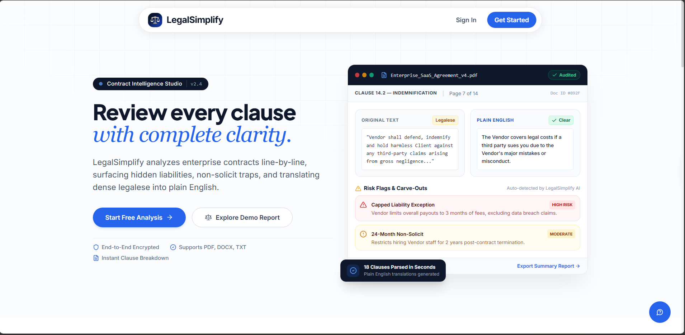
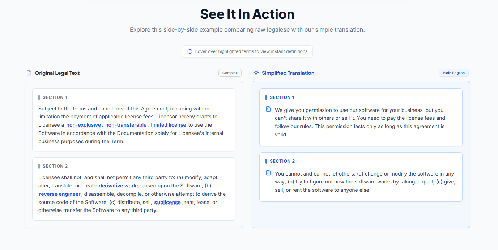
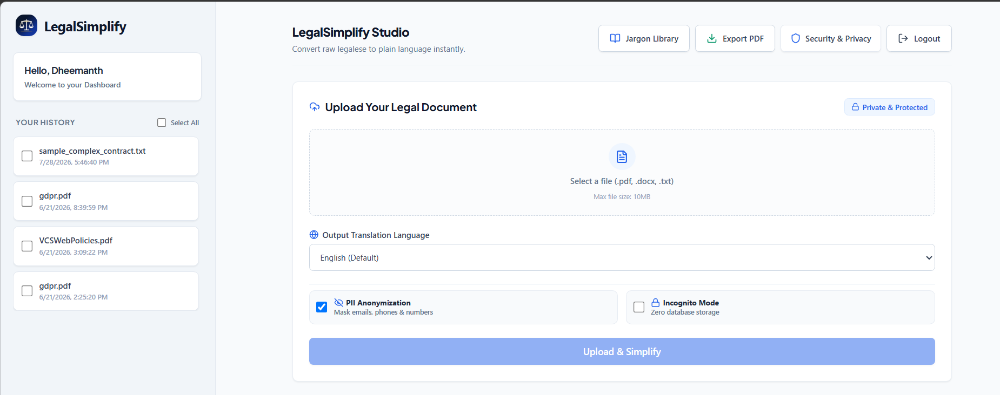
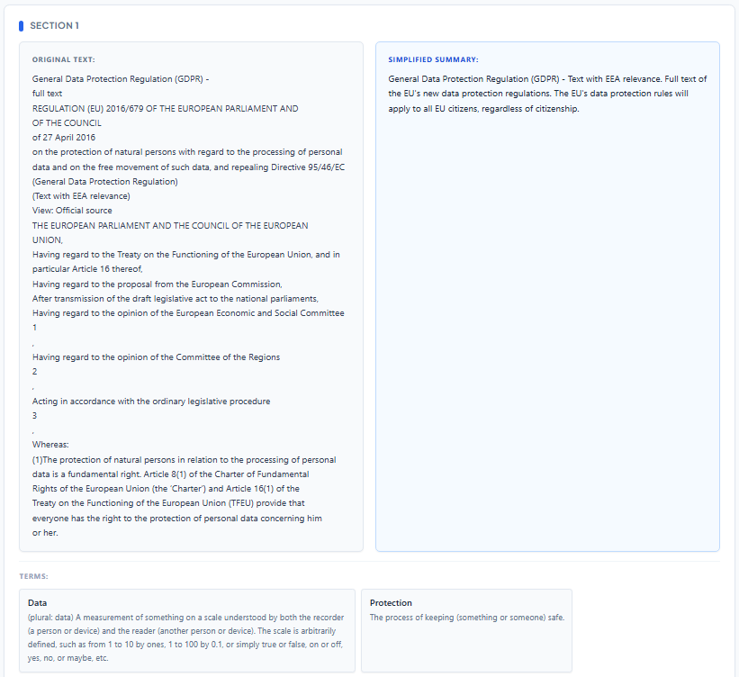
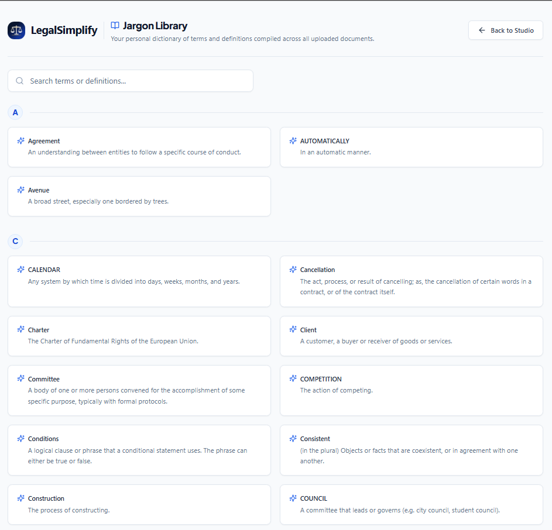

# LegalSimplify - AI-Powered Contract & Legal Document Simplifier



LegalSimplify is a full-stack web application built to parse, analyze, and simplify complex legal contracts into clear, plain language. It features an asynchronous section-aware NLP pipeline that dynamically breaks down documents along clause boundaries, streams section-by-section analysis to MongoDB with incremental persistence, flags high-risk legal clauses, generates automated glossaries, and exports print-ready PDF reports.



The project uses a modern monorepo architecture:
- **`frontend`**: React 18 and TypeScript application powered by Vite, Tailwind CSS, and Shadcn UI components.
- **`backend`**: Node.js and Express API built natively on ES Modules (ESM), connected to MongoDB for document storage and integrated with Supabase for user session authentication.

---

## Architecture and Key Features

### 1. Document Analysis Studio & Dashboard
Manage document history and upload contracts in `.pdf`, `.docx`, or `.txt` formats from a responsive dashboard interface.



### 2. Async Section-Aware AI Processing Pipeline
Contract texts are dynamically chunked along section and clause boundaries (`\n\n+` regex rules). Analysis is processed through a resilient multi-tier AI waterfall strategy:
- **Primary**: Google Gemini 1.5 Flash API for high-speed section summarization and structured risk extraction.
- **Fallback Tier 1**: Groq Llama-3.1-8b API if primary quota or rate limits are reached.
- **Fallback Tier 2**: Local Hugging Face BART-CNN model pipeline.
- **Incremental Persistence**: Saves each analyzed section immediately to MongoDB using Mongoose `$push` updates, providing instantaneous results to users without waiting for entire large contracts to complete.



### 3. Automated Legal Jargon Library & Translation
Identifies complex legal terms, retrieves dictionary definitions via integrated APIs, and maintains a searchable glossary per document. Includes script detection via `franc-min` and client-side neural translation across English, Hindi, Kannada, Tamil, and Telugu via `@xenova/transformers`.



### 4. Client-Side PDF Report Engine
Generates print-formatted PDF exports using HTML2Canvas and jsPDF element rendering, maintaining document styling and clause hierarchy.

---

## Tech Stack

### Frontend
- React 18 with Vite
- TypeScript
- Tailwind CSS & Shadcn UI
- Supabase Client (Authentication and JWT session management)
- HTML2Canvas & jsPDF (Client-side PDF report rendering)
- Axios

### Backend
- Node.js (v20+) configured for native ES Modules (`"type": "module"`)
- Express.js (v5 API framework)
- MongoDB & Mongoose (Schema validation & section-level updates)
- Multer (In-memory file uploads with 10MB payload guards)
- PDF-Parse & Mammoth (Raw text extraction for PDF and Word documents)
- Google Gemini API, Groq SDK, & Hugging Face Inference API
- Helmet & Express-Rate-Limit (Security headers and request rate control)

---

## Getting Started

### Prerequisites
- Node.js (v20.0.0 or higher)
- MongoDB instance (local or MongoDB Atlas cluster)
- Supabase account with Email authentication provider enabled
- Google Gemini API key and/or Groq API key

---

### Backend Setup

1. Navigate to the backend directory:
```bash
cd backend
```

2. Install dependencies:
```bash
npm install
```

3. Create a `.env` file inside `backend/`:
```env
PORT=5000
MONGODB_URI=your_mongodb_connection_string
SUPABASE_URL=your_supabase_project_url
SUPABASE_SERVICE_ROLE_KEY=your_supabase_service_role_key
GEMINI_API_KEY=your_gemini_api_key
GROQ_API_KEY=your_groq_api_key
HUGGINGFACE_API_KEY=your_huggingface_api_key
FRONTEND_URL=http://localhost:8080
```

4. Start the backend development server:
```bash
npm start
```

---

### Frontend Setup

1. Navigate to the frontend directory:
```bash
cd frontend
```

2. Install dependencies:
```bash
npm install
```

3. Create a `.env` file inside `frontend/`:
```env
VITE_SUPABASE_URL=your_supabase_project_url
VITE_SUPABASE_ANON_KEY=your_supabase_anon_key
VITE_BACKEND_URL=http://localhost:5000
```

4. Start the Vite development server:
```bash
npm run dev
```

The frontend application will be accessible at `http://localhost:8080`.

---

## Verification & Testing

### Running Backend Unit & Integration Tests

The backend test suite runs natively in Node ES Modules mode using Jest's VM modules runner:

```bash
# Run backend test suite
npm test --prefix backend

# Run backend tests in CI mode with coverage collection
npm run test:ci --prefix backend
```

### Frontend Typechecking & Linting

```bash
cd frontend
npm run typecheck
npm run lint
```

### Production Build Verification

```bash
cd frontend
npm run build
```

---

## Deployment Configuration

### Frontend (Vercel)
- Environment Variables: Set `VITE_SUPABASE_URL`, `VITE_SUPABASE_ANON_KEY`, and `VITE_BACKEND_URL`.
- Root Directory: `frontend`
- Build Command: `npm run build`
- Output Directory: `dist`

### Backend (Render / Railway)
- Environment Variables: Set `MONGODB_URI`, `SUPABASE_URL`, `SUPABASE_SERVICE_ROLE_KEY`, `GEMINI_API_KEY`, `GROQ_API_KEY`, `HUGGINGFACE_API_KEY`, and `FRONTEND_URL`.
- Root Directory: `backend`
- Start Command: `npm start`
- Ensure Supabase Auth settings include your live deployment URL under **Site URL** and **Redirect URLs**.